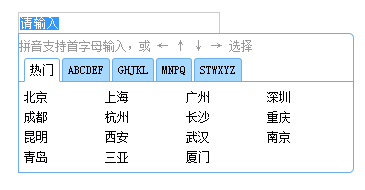
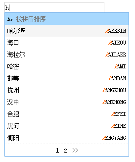

city-picker
===========

this is used to picking a city the one customers want to  locate.  

应用场景
--------

这是一个城市选择器，适用于需要搜索城市关键字来搜索的任何场景。


界面截图
--------




需要的数据格式：

```js
var alien_f_city=[
	{label:"热门",//指定选择界面的tab标签显示的文字，如果没有label字段或等于false,该组数据将不再选择界面显示；
	cities:[
			['北京','BEIJING','PEK'],
			['上海','SHANGHAI','SHA'],
			['广州','GUANGZHOU','CAN'],
			['深圳','SHENZHEN','SZX'],
			['成都','CHENGDU','CTU'],
			['杭州','HANGZHOU','HGH'],
			['长沙','CHANGSHA','CSX'],
			['重庆','CHONGQING','CKG'],
			['昆明','KUNMING','KMG'],
			['西安','XIAN','XIY'],
			['武汉','WUHAN','WUH'],
			['南京','NANJING','NKG'],
			['青岛','QINGDAO','TAO'],
			['三亚','SANYA','SYX'],
			['厦门','XIAMEN','XMN']
		]
	},
	{label:['ABCDEF','GHIJKL','MNOPQR','STUVWXYZ'],//如果标签按照字母分类指定了tab标签显示内容，那么会帮你自动按照指定的字符分类，生成tab和其对应要显示的数据
	isSearch:false,//如果没有isSearch或其值等于false，那么在搜索时，将不在该组数据里进行搜索。
	cities:[

			['上海','SHANGHAI','SHA'],
			['黄岩(台州)','HUANGYAN','HYN'],
			['杭州','HANGZHOU','HGH'],
			['义乌','YIWU','YIW'],
			['衢州','JUZHOU','JUZ'],
			['舟山(普陀山)','ZHOUSHAN','HSN'],
			['温州','WENZHOU','WNZ']
		]
	},
	//下面这组数据只进行搜索，不会在选择界面生成tab标签
	{label:false
	isSearch:true,
	cities:[
			['太原','TAIYUAN','TYN'],
			['武汉','WUHAN','WUH'],
			['无锡','WUXI','WUX'],
			['顺德','SHUNDE','SDE'],
			['苏州','SUZHOU','SOZ'],
			['郑州','ZHENGZHOU','CGO']
		]
	}
]
```

特性：
------

兼容主流浏览器，包括ie6+；

支持更换皮肤；

选择界面：支持设置其宽,支持设置每一列数据的宽度（每一列数据所占界面宽度的百分比），当然前2者也决定了总列数；
选择界面：指定tab标签显示的文字及其下边和它对应的数据；

搜索界面：支持指定要搜索的数据源


